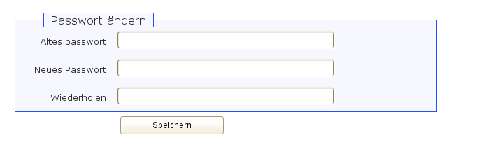
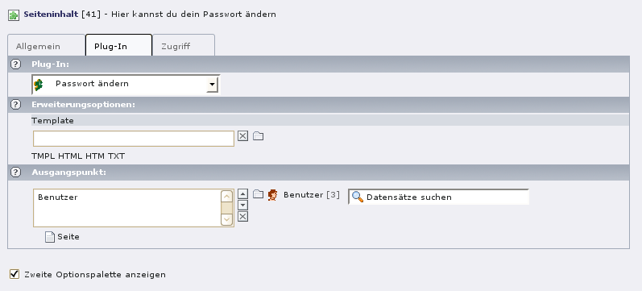

***********************************
EXT: Change front end user password
***********************************
Extension Key: ``changepassword``

Copyright 2011, Muhammed Alat, <info [mailat] alatsystems [domaindot] de>

============
Introduction
============

What does it do?
================
Changepassword is a simple frontend plugin to change the password
of front end users.
It supports changing plain text passwords, md5 passwords and
saltedpasswords password.

Screenshots
===========

============
Installation
============
- Import ``changepassword`` from Extension repository and install .
- Create a page that will be displayed when fe users are logged in and
  want to change their passwort.
- Now you can create a page content where users can change their passwords.
  Here you may use the ``changepassword`` FE Plugin on this page to display
  the changepassword form.

=============
Configuration
=============
You can change the default template by selecting another from your
``fileadmin`` folder.
Just copy the original template from
``typo3conf/ext/changepassword/res/template.html`` to
``fileadmin/changepassword.html`` and change the layout.
Furthermore you habe to select a source Page where the front end users
are stored.
Don't forget to select the stored Page.
In the example below the page “Benutzer” with the ``id`` 3 is selected.

=========
Reference
=========
To be updated.

=======
Samples
=======
If you have a subpart ``CHANGEPASSWORD`` you can load the plugin via the
following TypoScript configuration::

    page.10.subparts.CHANGEPASSWORD < plugin.tx_changepassword_pi1

You are also free to load it in any other part of your TypoScript
configurations.

==============
Known problems
==============
There are no known problems at the moment.
If you find any bugs, please report them.
You can report them due to the online form http://www.alatsystems.de/kontakt/.

==========
To-Do list
==========
- Insert a constant with the minimum length of the newpassword,
  now it is hardcoded with 6.

=========
Changelog
=========
- 2011-07-08: Bug Fixes: Thanks to Boris Glusmann from http://www.horschler.eu
- 2010-03-12: Update Documentation
- 2010-03-10: Initial release
